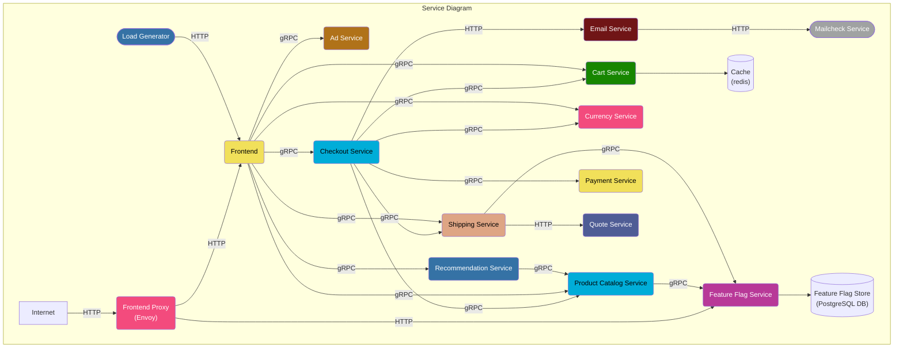
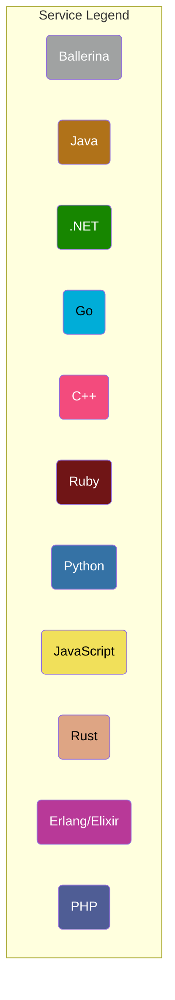

# Project Description
This is a fork of the official OpenTelemetry Microservices Demo application, with an additional service written in Ballerina.

## Architecture

# Remaining Tasks
## High priority
[ ] Change the service name in the Ballerina API from `/` to `mailcheckservice` in alignment with other services
[ ] Fork the *ballerinax/jaeger* module, add a configurable context propagator (supporting jaeger format by default, which is the current state, as well as the W3C propagator), and build a snapshot of the module
[ ] Pull the snapshot *ballerinax/jaeger* module featuring W3C propagator support into `mailcheckservice` image and deploy to Docker
[ ] Confirm traces are connected as intended

## Non-critical
[ ] File issue in the *ballerinax/jaeger* module repo explaining the current implementation of context propagators as well as the need for a (currently missing) W3C propagator
[ ] Submit PR for the *ballerinax/jaeger* module 
[ ] Provide tiltfile to help automate the local deployment of the demo onto a Kubernetes cluster with included OpenTelemetry monitoring